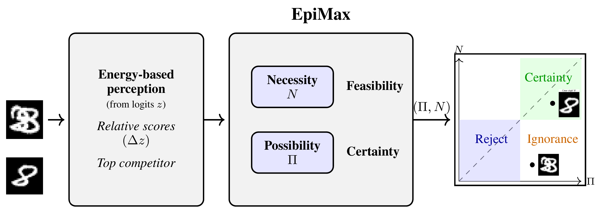
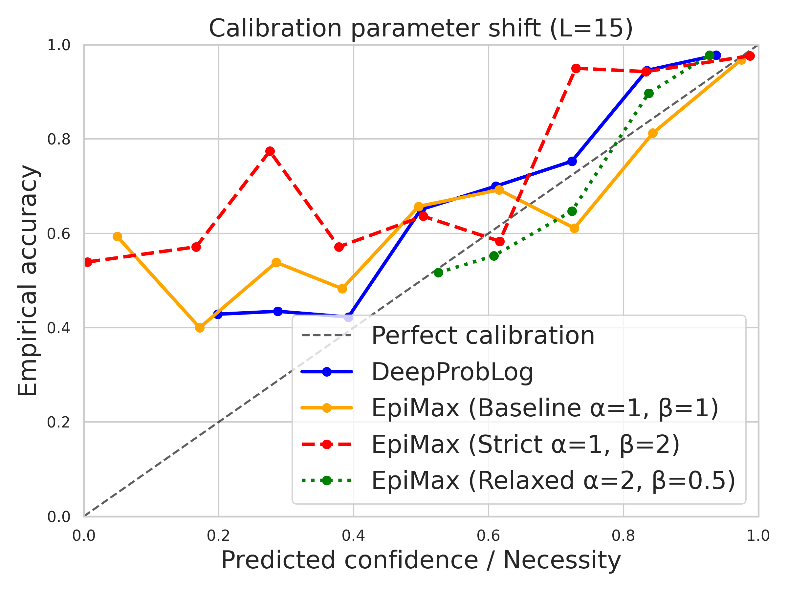
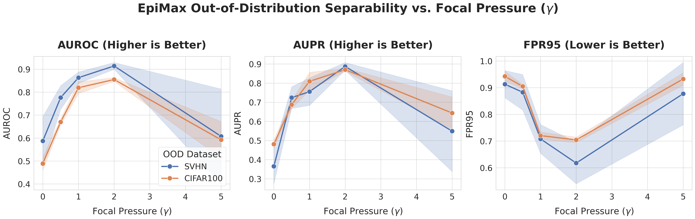

# EpiMax: Possibilistic Learning from Raw Logits via Energy-Based Margins

[](https://creativecommons.org/licenses/by/4.0/)
[](https://neurips.cc/)

This repository is the official implementation of the NeurIPS 2026 paper: **[EpiMax: Possibilistic Learning from Raw Logits via Energy-Based Margins](https://arxiv.org/abs/XXXX.XXXXX)**. 

### What is EpiMax?
Standard deep classifiers rely on softmax normalization, which forces competition on the probability simplex and structurally conflates different types of uncertainty. **EpiMax** is a learning framework that bypasses softmax entirely. By mapping unnormalized neural energies to Possibility Theory, EpiMax directly computes **Possibility** ($\Pi$, feasibility) and **Necessity** ($N$, certainty) from raw logits. This dual representation explicitly isolates epistemic ignorance ("I don't know") and prevents catastrophic confidence dilution in neuro-symbolic reasoning.


*Figure 1: Visual overview of the EpiMax framework. Unlike standard baselines that enforce global competition via softmax normalization, EpiMax derives dual possibilistic measures from relative energy margins. This decoupling projects predictions into a 2D epistemic space, structurally isolating regions of certainty, active rejection, and epistemic ignorance.*


## Requirements
>📋 The following are the environments and dependencies 

### Environment and Dependencies

The project was developed using Python 3.11 with CUDA 12.4 support.

### Core Deep Learning Libraries
- PyTorch == 2.6.0 (+cu124)
- TorchVision == 0.21.0 (+cu124)
- TorchAudio == 2.6.0 (+cu124)
- TensorFlow == 2.21.0
- Triton == 3.2.0

### Scientific Computing
- NumPy == 2.2.6
- SciPy == 1.15.3
- Pandas == 2.3.3
- SymPy == 1.13.1
- scikit-learn == 1.7.2

### Visualization
- Matplotlib == 3.10.9
- Seaborn == 0.13.2
- Graphviz == 0.21

### Neural Network / ML Utilities
- Keras == 3.12.1
- h5py == 3.14.0
- NetworkX == 3.4.2

### CUDA Libraries
- CUDA Toolkit == 12.4
- cuDNN == 9.1
- NCCL == 2.21

### Additional Utilities
- Jinja2 == 3.1.6
- Requests == 2.33.1
- Rich == 15.0.0

---

## Installation

```bash
conda create -n epimax python=3.11
conda activate epimax

pip install -r requirements.txt
```

---

## Reproducibility

For exact environment reproduction:

```bash
conda env create -f environment.yml
```
## Repository Structure

The codebase is organized to strictly separate experimental execution and configuration from the core mathematical logic (such as the possibilistic mappings and neural architectures). 

```text
.
├── configs/                             # YAML configurations for various experiment parameters
├── data/                                # Default directory for downloaded datasets
├── src/                                 # Core mathematical and architectural logic
│   ├── datasets/                        # Data loaders and preprocessing
│   ├── losses/                          # Loss functions (contains the main epimax_loss.py)
│   ├── models/                          # Neural architectures (perception and logic models)
│   └── utils/                           # Evaluation metrics and visualization helpers
    │   └──run_plots_experiment_ood_cifar10_svhn_nvidiav100.py    # Script for the out-of-distribution detection across semantic and structural shifts experiment.
├── run_toy_experiment.py                # Sript that runs the experiment stability on synthetic manifolds (in suppl. material).
├── run_possibilistic_chaining_modus_ponens.py # Script to run the experiment on possibilistic modus ponens 
├── run_robustness_test_v2.py            # Script to run the MNIST addition task experiment
├── requirements.txt                     # Project dependencies
└── README.md                            # This documentation

## Training

To train the EpiMax models on standard datasets (e.g., MNIST for the baseline OOD experiments), use the src/losses/epimax_loss.py file to train your model. ou can explicitly control the dual possibilistic loss margins using the --alpha, --beta, and --gamma hyperparameters. For example, to revise the results of the stability on synthetic manifolds, you can use the following command:

```bash
conda activate epimax_env
python run_toy_experiment.py
```

## Experiments and results

### Stability on synthetic manifolds
This experiment evaluates the stochastic stability of the uncertainty manifold by measuring how consistently each framework identifies Out-of-Distribution (OOD) regions across independent training runs. Ten identical Multi-Layer Perceptron (MLP) architectures were initialized with different random seeds. The results demonstrate that EpiMax achieves near-total invariance in its epistemic boundary formation, contrasting sharply with the severe instability observed in Evidential Deep Learning (EDL) and the moderate boundary drift in Deterministic Uncertainty Quantification (DUQ) frameworks.


*Figure 1: Heatmaps visualizing the pixel-wise standard deviation of predicted uncertainty across 10 random initializations. EpiMax maintains structural consistency in unobserved regions.*

### Out-of-distribution detection across semantic and structural shifts
To evaluate the epistemic boundary formed by the dual possibilistic loss, this experiment benchmarks the framework's capability to reject Near-OOD and Far-OOD samples. The network was trained on CIFAR-10 and evaluated against SVHN (structural shift) and CIFAR-100 (semantic shift). The detection performance exhibits a highly non-linear dependence on the focal pressure parameter ($\gamma$).


*Figure 2: AUROC, AUPR, and FPR95 metrics demonstrating optimal epistemic boundary formation at $\gamma=2.0$. Unregularized configurations fail to shape a coherent boundary, while excessive focal penalties cause severe optimization instability.*

### Scalability in neuro-symbolic tasks
This task evaluates the scalability of EpiMax in deep reasoning chains using an extended zero-shot MNIST-Addition task. A perception network pre-trained on single digits is evaluated across increasing logical chain lengths ($L$). The results empirically confirm the structural degradation (multiplicative confidence dilution) suffered by standard t-norms, whereas EpiMax prevents rapid epistemic signal loss.

| Chain length ($L$) | Probabilistic | MAP (Max-Prod) | LTN (Fuzzy) | EpiMax (Poss) |
|--------------------|---------------|----------------|-------------|---------------|
| 2                  | 96.90%        | 97.50%         | 96.70%      | 97.40%        |
| 5                  | 92.80%        | 92.90%         | 92.40%      | 92.70%        |
| 10                 | 86.10%        | 85.80%         | 85.90%      | 85.60%        |
| 15                 | 79.58%        | 80.78%         | 79.73%      | 78.38%        |
| 20                 | 75.60%        | 74.00%         | 74.60%      | 72.20%        |

### Performing modus ponens
Modus ponens is a fundamental rule of inference. This controlled experiment evaluates deductive reasoning capabilities utilizing the possibilistic "weakest link" principle. The results demonstrate the preservation of explicit epistemic necessity across increasing chain lengths ($L$), contrasting with the rapid collapse of confidence in probabilistic and fuzzy logic baselines.

| $L$ | Oracle acc. (%) | DeepProbLog conf. | LTN conf. | EpiMax conf. |
|-----|-----------------|-------------------|-----------|--------------|
| 2   | 22.00           | 0.2622            | 0.0241    | 0.0422       |
| 5   | 1.00            | 0.0353            | 0.0000    | 0.0237       |
| 10  | 0.00            | 0.0012            | 0.0000    | 0.0164       |
| 15  | 0.00            | 0.0000            | 0.0000    | 0.0088       |
| 20  | 0.00            | 0.0000            | 0.0000    | 0.0056       |


## Contributing & License
This project is licensed under the CC BY 4.0 License 

We welcome contributions! If you are interested in extending possibilistic learning to generative architectures (e.g., epistemic decoding in LLMs), please open an issue or submit a pull request.

